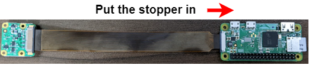

# FlightCamera

## Assembly

If you finish activation of the flight camera mode referencing the [page](./setup.md), you can go forward to the next step, assembly of the module. In this section, details of components and their assembly are explained.

### Board Overview

The figure below is a board of the flight camera module. The module has some features:

- **Status LED** tells status of the program in the flight camera mode.
- **XH pin socket** is the interface to a flight pin.


### Raspberry Pi Zero

The below picture is of a Raspberry Pi Zero. Raspberry Pi Zero has 40 of GPIO pins and some interfaces, e.g. HDMI, USB and Raspberry Pi Camera. It is recommended to connect to a monitor and keyboard when you setup a Raspberry Pi.


!!!info "Setup a Raspberry Pi Zero without a monitor"
    There is a way to setup a Raspberry Pi Zero without a monitor, but it is not recommended because it has more steps for setup and you cannot get any signals if there is something wrong.

### Connecting a Camera

1. Prepare a Raspberry Pi Camera and flexible cable for Raspberry Pi Zero. Note that the cable for Raspberry Pi Zero is not same as one of Type A or B.
   

2. Raspberry Pi Zero has a camera socket and its stopper (black part of the bottom). Put the stopper down to insert the cable.<br>
   

3. Insert the cable into the socket and put the stopper in to fix the cable.
   

### Board Assembly

1. Insert GPIO pins into the pin socket on the board.
2. Connect a flight pin cable to the XH socket.
3. Put in a 9V battery to the battery holder. And then, the Raspberry Pi starts to boot.


## Flow of the program

### Operations

1. Program starts at booting.
2. Status LED blinks until the flight pin is connected.
    
3. After the flight pin is connected, the status LED is turned off until the flight pin is to be disconnected.
4. When the flight pin is disconnected, the stauts LED is turned on and recording starts.
5. Observing if any commands occur while recording.
6. When the time elapses to the value of `timeout` or a command is detected, recording stops.
7. If the setting is configured, the system is automatically shutted down.

### Commands

There are some commands for users to operate state of the program.

| name | condition | description |
|:---:|:---:|:---|
| NULL | --- | No commands are activated. |
| RESTART | Flight pin connection in more than `threshold_restart` seconds. | Program will stop recording and restart from the begging. Parameter `threshold_restart` can be set in `glm.py`, defaults 5 seconds. |
| EXIT | Flight pin connection in less than `threshold_exit` seconds, and then disconnection in more than `threshold_exit` seconds. | Program will stop recording and exit immediately without shutting down. Parameter `threshold_exit` can be set in `glm.py`, defaults 2 seconds. |

### Flowchart

Characters in red in the flowchart below are parameters in the application. For more information, see [Setting](./setting.md).


## Outputs

The flight camera application outputs two kinds of files, one is a movie file and the other is a log file.

### Movie Files

Movie files are the main outputs of the application. You can specify path to a movie file before activating the flight camera mode, by writing the path to `glm.py`. See [Setting](./setting.md#filemov) for details.

In the default setting, the format of movie files is `.h264`. This format could not be played in your favorite movie player. It is recommended using [VLC media player](https://www.videolan.org/vlc/index.ja.html) for playing the format of movies. However, there can exist block noise when playing `.h264` videos, so it might be ideal that you convert `.h264` format to `.mp4`.

### Log Files

Log files are useful to analysis state of the application, especially during debug. You can also specify path to a log file before activating the flight camera mode. See [Setting](./setting.md#filelog) for more information.

The log level of the application can be changed in `glm.py`. You can specify `logging.DEBUG` as parameter `log_level` to output verbose log for debugging.

Below is an example of the log output.

```log
[2022-08-02 03:59:53,126] [INFO] Start the Flight camera mode. Setting; glm_name: main, timeout: 210.0, pin_flight: 22, pin_led: 12, file_mov: mov-220802-035953.h264, file_log: mov-220802-035953.log, parent_dir: None, resolution: (1920, 1080), framerate: 30, interval: 0.1, led_blink_freq: 2.0, log_level: 20, check_waiting_time: False
[2022-08-02 03:59:53,218] [INFO] Waiting a flight pin to be connected...
[2022-08-02 04:00:01,074] [INFO] Detected that the flight pin was connected.
[2022-08-02 04:00:01,075] [INFO] Wating the flight pin to be disconnected...
[2022-08-02 04:00:03,034] [INFO] Detected that the flight pin was disconnected.
[2022-08-02 04:00:03,034] [INFO] Start recording.
[2022-08-02 04:03:33,151] [INFO] Stop recording.
```
