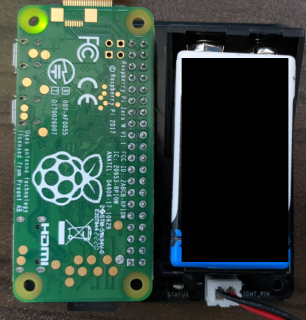

# FlightCamera

## Assembly

### Board Overview

The figure below is a board of the flight camera module. The module has some features:

- **Status LED** tells status of the program in the flight camera mode.
- **XH pin socket** is the interface to a flight pin.

### Raspberry Pi Zero

The below picture is of a Raspberry Pi Zero. Raspberry Pi Zero has 40 of GPIO pins and some interfaces, e.g. HDMI, USB and Raspberry Pi Camera. It is recommended to connect to a monitor and keyboard when you setup a Raspberry Pi.

!!!info "Setup a Raspberry Pi Zero without a monitor"
    There is a way to setup a Raspberry Pi Zero without a monitor, but it is not recommended because it has more steps for setup and you cannot get any signals if there is something wrong.

### Connecting a Camera

1. Prepare a Raspberry Pi Camera and flexible cable for Raspberry Pi Zero. Note that the cable for Raspberry Pi Zero is not same as one of Type A or B.
   

2. Raspberry Pi Zero has a camera socket and its stopper (black part of the bottom). Put the stopper down to insert the cable. 
   

3. Insert the cable into the socket and put the stopper in to fix the cable.
   

### Board Assembly

1. Insert GPIO pins into the pin socket on the board.
2. Connect a flight pin cable to the XH socket.
3. Put in a 9V battery to the battery holder. And then, the Raspberry Pi starts to boot.

## Flow of the program

### Operations

0. **Do not connect the flight pin before booting**.
1. Program starts at booting.
2. Status LED blinks until the flight pin is connected.
    
3. After the flight pin is connected, the status LED is turned off until the flight pin is to be disconnected.
4. When the flight pin is disconnected, the stauts LED is turned on and recording starts.
5. When the time elapses to the value of `timeout`, recording stops.

### Flowchart

