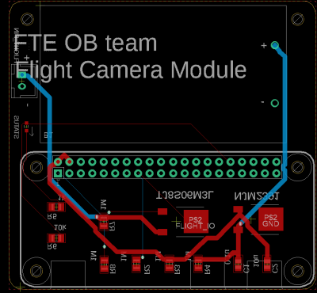

# obcam



`obcam` is the flight camera module and program for the OB team rocket in NSE 2022. See [the site](https://FROM-THE-EARTH.github.io/obcam/) for details.

## Install

```bash
python -m pip install git+https://github.com/FROM-THE-EARTH/obcam.git
```

**Pre-requirements**

- `pip`

## Install and Activate the flight camera mode

```bash
git clone https://github.com/FROM-THE-EARTH/obcam.git
cd obcam

# After filling out and confirming the glm.py
# See the documentation for detail of the settings.
sudo ./install.sh
```

**Pre-requirements**

- `git`

**Note**

This operation requires network connection.

## Scripts

Scripts in the `scripts` directory may be useful if you want some small operations like installing just `obcam`, activate the flight camera mode, or deactivate the flight camera mode. See [the site](https://FROM-THE-EARTH.github.io/obcam/scripts/) for more information.

**`activate_camera.sh`**

This script activates the Raspberry Pi Camera of a module. Note that the Raspberry Pi Camera is not activated right after the first booting.

**`activate_flightcam.sh`**

This script activates the flight camera mode of the `obcam`. In the flight camera mode, the program of the `obcam` run automatically when booting.

**`deactivate_flightcam.sh`**

This script deactivates the flight camera mode.

**`install_obcam.sh`**

This script installs the `obcam` module using `pip`. Note that `pip` should be installed before executing this script.

**`install_pip.sh`**

This script installs `pip`. Note that `pip` could be not installed yet right after the first booting. Thus, this script might be useful in the situation.

**`uninstall_obcam.sh`**

This script uninstalls the `obcam` module using `pip`.
